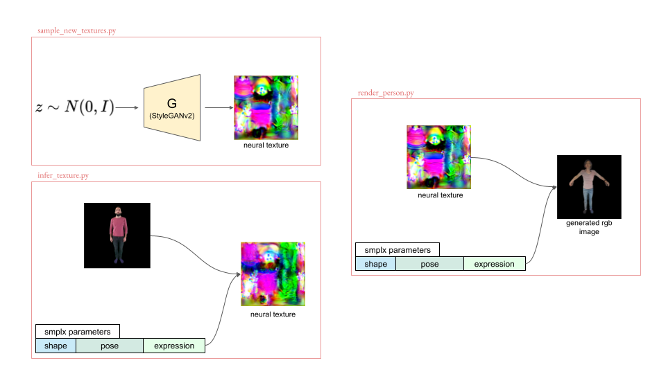

# StylePeople

###  [Project](https://saic-violet.github.io/style-people/) &ensp;  [Paper](https://arxiv.org/pdf/2104.08363.pdf) &ensp;  

This is repository with inference code for paper [**"StylePeople: A Generative Model of Fullbody Human Avatars"**](https://arxiv.org/pdf/2104.08363.pdf) (CVPR21).
This code is for the part of the paper describing generative neural textures model. For inference of video-based avatars refer to [this repository](https://github.com/dolorousrtur/neural-textures).

## Getting started
### Data
To use this repository you first need to download model checkpoints and some auxiliary files.

* Download the archive with data from [Google Drive](https://drive.google.com/file/d/1xfsCIy5Xn_fS9uqC23svB_tjiJw543ZF/view?usp=sharing) and unpack in into `StylePeople/data/`. It contains:
	* checkpoints for generative model and encoder network (`data/checkpoint`)
	* A few samples from *AzurePeople* dataset to run inference script on (`data/inference_samples`)
	* A sample of smplx parameters (`data/smplx_sample.pkl`)
	* Some auxiliary data (`data/uv_render` and `data/*.{yaml,pth,npy}`)
* Download SMPL-X models (`SMPLX_{MALE,FEMALE,NEUTRAL}.pkl`) from [SMPL-X project page](https://smpl-x.is.tue.mpg.de/) and move them to `data/smplx/`

### Docker
The easiest way to build an environment for this repository is to use docker image. To build it, make the following steps:
1. Build the image with the following command:
```
bash docker/build.sh
```
2. Start a container:
```
bash docker/run.sh
```
It mounts root directory of the host system to `/mounted/` inside docker and sets cloned repository path as a starting directory.

3. **Inside the container** install `minimal_pytorch_rasterizer`. (Unfortunately, docker fails to install it during image building)
```
pip install git+https://github.com/rmbashirov/minimal_pytorch_rasterizer
```
4. *(Optional)* You can then commit changes to the image so that you don't need to install  `minimal_pytorch_rasterizer` for every new container. See [docker documentation](https://docs.docker.com/engine/reference/commandline/commit/).

## Usage   
This repository provides three scripts with three scenarios, as it is shown on the scheme below:

<p align="center">
  
</p>

Below are brief descriptions and examples of usage for these scripts. Please see their argparse help message for more details.

### Sample texture from generative model
`sample_new_textures.py` samples a number of neural textures from generative model and saves them on disc.

Example:
```
python sample_new_textures.py --n_samples=10 --texture_batch_name='my_run'
```
will sample 10 neural textures and save them to `data/textures/my_run`

### Infer a neural texture for a given set of images
`infer_texture.py` fits a neural texture to a given set of data samples. See `data/inference_samples/` for samples' examples.

Example:
```
infer_texture.py --input_path=data/inference_samples/azure_04 --texture_out_dir=data/textures/azure_04
```
will load all data samples from `data/inference_samples/azure_04` and save inferred texture to `data/textures/azure_04`


### Render an image of a person with given neural texture and smplx parameters
`render_person.py` generates an image of a person with given shape, pose, expression and neural texture.

Example:
```
python render_person.py --texture_path=data/textures/my_run/0000/texture.pth --smplx_dict_path=data/smplx_sample.pkl --save_dir=data/my_person
```
will render a person with neural texture from `data/textures/my_run/0000/texture.pth` and smplx parameters from `data/smplx_sample.pkl` and save generated images to `data/my_person`.